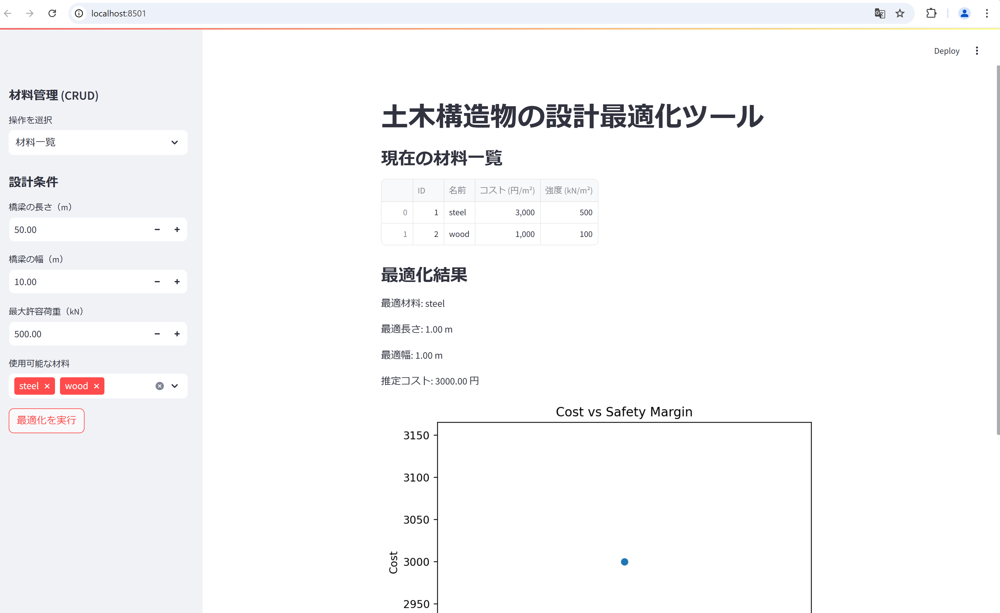

# 土木構造物の設計最適化ツール

このプロジェクトは、土木構造物（例: 橋梁）の設計を最適化するためのツールです。指定した材料や設計条件を基に、コストを最小化しつつ安全性を確保する最適な設計を提案します。

---

## 主な機能

1. **材料管理 (CRUD)**  
   材料の追加、編集、削除、一覧表示が可能です。

2. **設計条件の入力と最適化**  
   橋梁の長さ、幅、最大荷重を入力し、最適な設計を計算します。

3. **結果の可視化とエクスポート**  
   最適化の結果をグラフで確認し、CSV形式でダウンロードできます。

---

## デモ画面

アプリケーションの動作イメージ：


---

## 使用技術

- **言語**: Python
- **ライブラリ**:
  - [Streamlit](https://streamlit.io/): 簡単なWebアプリケーションを構築
  - [SciPy](https://scipy.org/): 最適化アルゴリズム
  - [Matplotlib](https://matplotlib.org/): データ可視化
  - [Pandas](https://pandas.pydata.org/): データ操作
  - [SQLite3](https://sqlite.org/): データベース管理

---

## ディレクトリ構造

```
project/
├── app.py             # Streamlitアプリのメインスクリプト
├── optimizer.py        # 設計最適化アルゴリズム
├── utils.py            # 可視化とエクスポートのユーティリティ
├── requirements.txt    # 必要なライブラリ一覧
├── images/             # デモ画面用の画像
│   └── demo.png        # デモ画面のスクリーンショット
└── materials.db        # SQLiteデータベース（初期化時に生成される）
```
---

## 注意事項
SQLiteデータベースは、アプリケーション実行時に自動的に初期化されます。
アップロードしたいデータはmain.pyのCRUD操作を利用して管理してください。

---
## インストール方法

1. **リポジトリをクローン**
   ```bash
   git clone https://github.com/ichi222/OptimizationTool_SQLite
   cd OptimizationTool_SQLite

2. 必要なライブラリをインストール Python 3.8以上をインストールした後、以下を実行します
```
pip install -r requirements.txt
```
3. アプリケーションを実行
```
streamlit run app.py
```
## 使い方
1. 材料の管理
サイドバーから「材料管理 (CRUD)」セクションを使用して、材料を追加、編集、削除、または一覧表示します。
2. 設計条件の入力
サイドバーから橋梁の長さ、幅、最大許容荷重を設定します。
使用する材料を選択します。
3. 最適化の実行
「最適化を実行」ボタンを押すと、最適な設計結果が表示されます。
4. 結果の確認とエクスポート
コストと安全性の関係をグラフで表示。
結果をCSV形式でダウンロード可能です。


